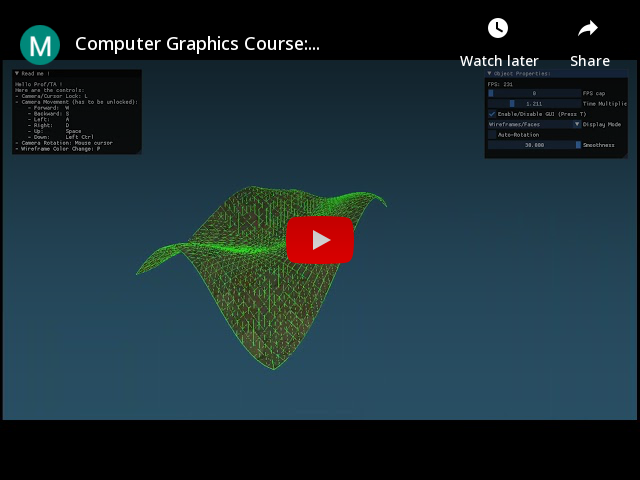

# Assignment 4 of Fundamentals of Computer Graphics: Snow Particles

    

# Introduction

For this assignment, the main theme was `Snow Particles`.

The objectives here were:

1) Particle effect of snowing
2) Snowflakes have different sizes.
3) Start with less snowflakes and gradually increase over time.

# Compilation

This project and all of my CG projects will be compiled with CMake, if you open the project directly with Visual Studio, you should be able to directly compile it.
Though, as CMake permits it, you will be easily able to compile on other platforms.

# Demonstration

## Content

For my Assignment, I got all these points covered:

- Snowing Particle Effects
- Snowflakes have different sizes that can be set
- Count of snowflakes that gradually increases over time
- Bonus:
    - Display Mode (Vertices, Wireframe, Faces)
    - Enable/Disable GUI
    - Particle Systems parameters can be edited

## How to use it

You can launch the `Assignment4.exe`directly, if you already have Visual C++ Redistribuable.

The program was compiled in Release mode.

As it is displayed in the program, here are the controls by order of priority for the assignment:

## Controls

- Enable/Disable GUI: T
- Wireframe Color Change: P
- Camera/Cursor Lock: L
- Camera Movement:
    - Forward: W (or Z on AZERTY layout)
    - Backward: S
    - Left: A (or Q on AZERTY layout)
    - Right: D
    - Up: Space
    - Down: Left CTRL

## Additional Interactions

- You can change every parameters related to the particle systems like:
    - Particle Speed
    - Spawn Radius
    - Gravity (Acceleration on Y axis) of particles, speed limited to the value of Gravity
    - Particle Min & Max Scales
    - Steps between Min & Max Scales
    - Frequency of emitted particles (particles/second)
    - Life Span of each particle (in seconds)
    - Maximum count of Particles
- You can change the Display Mode on the `Display Mode`menu.
- You can change the FPS cap/limit
- You can change the Time multiplier (multiplies deltaTime)

# Code Architecture

The Complete Documentation is available in the project, in the Code Architecture part will only be explained a small description of what classes do.

## Documentation

There is a documentation available [here](https://kevinpruvost.github.io/ComputerGraphics_Assignment4/) or in `docs/index.html` if you want to have a better view on the classes I made.
